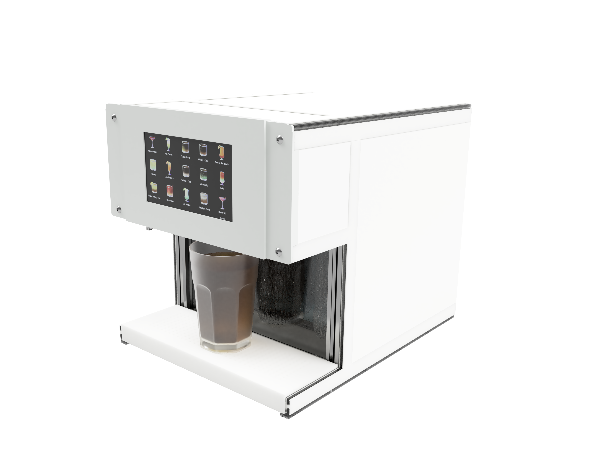
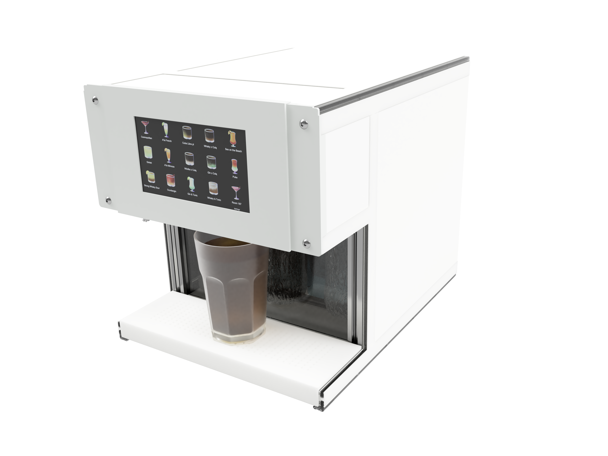
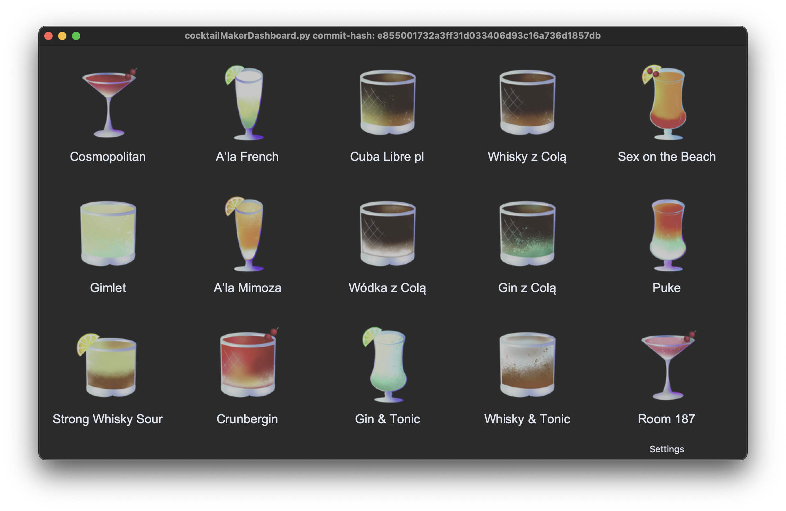
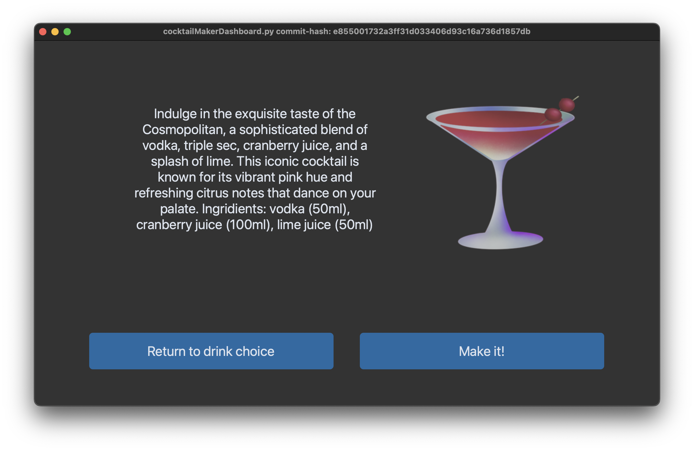
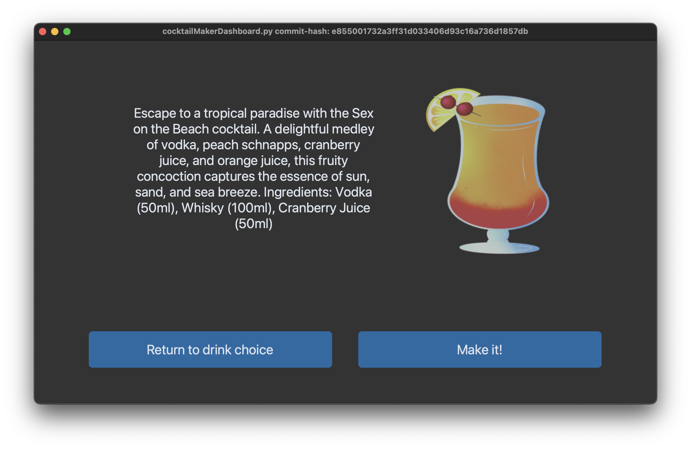
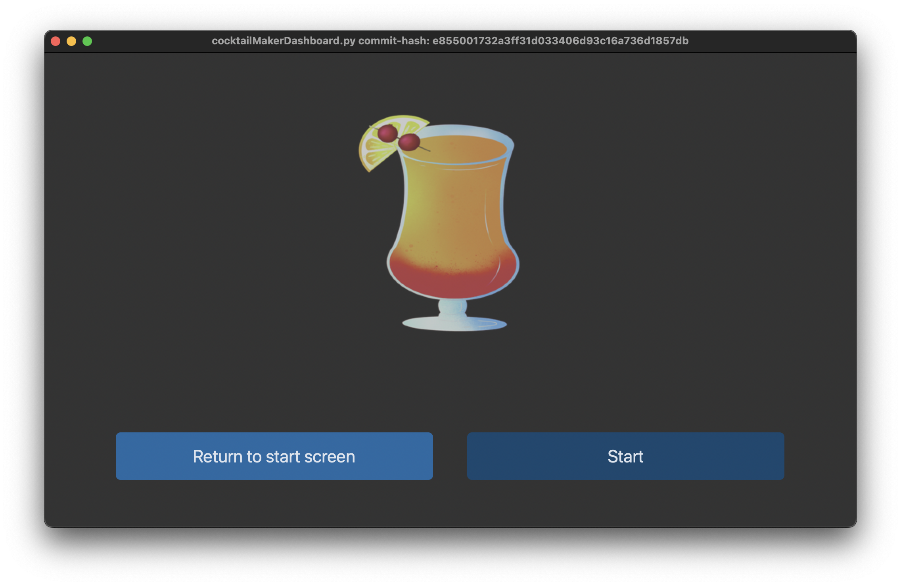
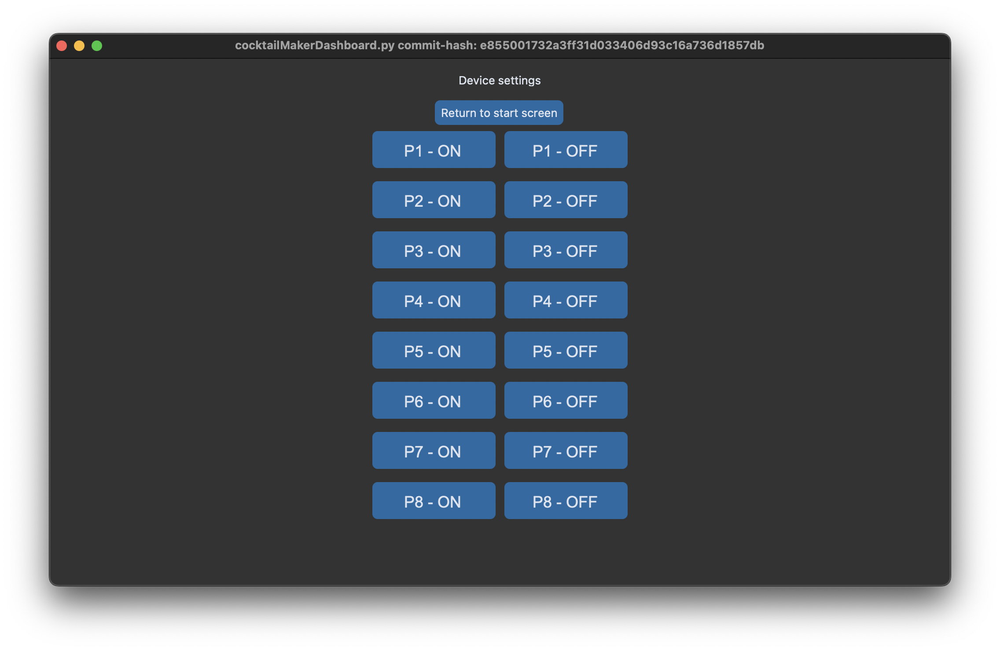
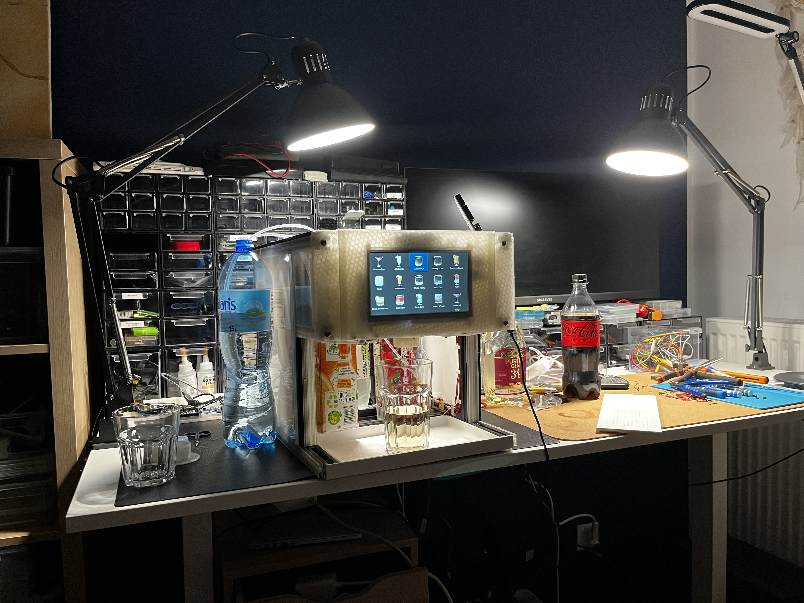
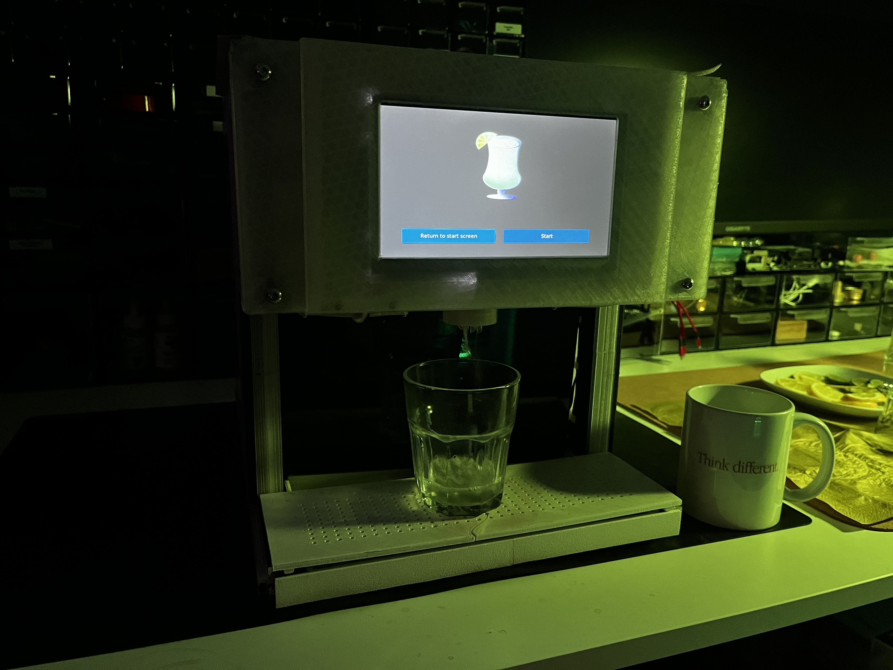
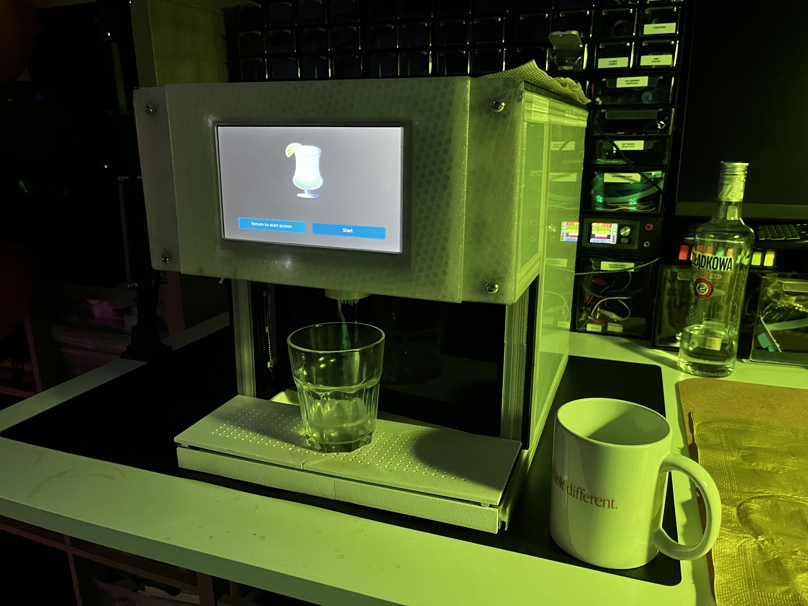

# cocktailMakerRev0

## Introduction

# Introduction

This project started as something fun I did for a New Year's Eve party. It's based on a machine I built for my engineering thesis. I used a Raspberry Pi Zero 2 with Debian, a 7-inch touchscreen, and a Raspberry Pi Pico with a relay module. I made the user interface with a Python library called customTkinter.

The Raspberry Pi Zero 2 talks to the Raspberry Pi Pico using a USB cable and serial communication. The programming for the Raspberry Pi Zero microcontroller is done in C. 

This first version of my machine was just a quick prototype, but it worked surprisingly well. It ran for 8 hours straight without stopping or having any problems.

## Mechanical hardware

The mechanical parts of this project were designed in Fusion 360. The main structure is built using extruded V-slot 2020 profiles, which makes it both sturdy and adaptable. To connect everything together and mount various components, I used custom 3D printed parts. This approach allowed for a lot of flexibility in design and made it easy to assemble.

For the side panels, I chose milky plexiglass. It gives the machine a sleek look while hiding the internal components. The plexiglass panels also help to diffuse any lights from inside the machine, adding to its visual appeal.

## Hardware - electronics

## Hardware - Electronics

The heart of the electronics in this project is the Raspberry Pi Zero 2 WiFi version. I chose it for its low power consumption and the ease of setting up the OS and drivers. This Raspberry Pi is mounted in the front part of the machine, right under the 7-inch touchscreen. The screen is a Waveshare model (MPN 11199), chosen for its compatibility and ease of use.

Next to the Raspberry Pi and screen, there's a compartment that houses a USB hub (Waveshare 12694). This hub is essential for connecting external devices like a keyboard and a CSI camera. I'm using these peripherals for my master thesis work, so having them easily connectable was a priority.

The Raspberry Pi Pico is connected to the Raspberry Pi Zero 2 via a micro USB cable. I've hooked up an 8-channel relay module to the GPIO pins on the Raspberry Pi Pico. This module controls the individual peristaltic pumps, allowing for precise management of their operations.

## Operating system

The Raspberry Pi Zero 2 in my project runs on a version of Debian compiled for ARMv8 architecture, commonly referred to as Armbian. This choice was driven by the need for a stable and reliable operating system that comes pre-equipped with all the necessary drivers for the Raspberry Pi. 

Opting for Armbian over a custom Linux distribution like Yocto Project or Buildroot was a deliberate decision. My main goal was to ensure the machine's functionality without getting bogged down in the intricacies of customizing the operating system. This approach allowed me to focus more on the project's hardware and software aspects, ensuring that everything worked seamlessly together.

## Software

# Software

The software foundation of this project is built on Python, utilizing the customTkinter library. customTkinter is a fork from the original Tkinter library but includes additional elements and an enhanced appearance for the UI components. This choice was pivotal in achieving a fast and responsive user interface, crucial for a good user experience on a device with limited resources. Notably, the UI consumes less than 30 MB of RAM, a significant factor considering the Raspberry Pi Zero 2's 512 MB RAM limitation.

### Known Working Configuration
The project is currently running smoothly with the following software versions:
- Python 3.10.12
- customTkinter 5.2.1
- Pillow 10.1.0

For a more detailed description of the software setup, including installation instructions and additional documentation, please visit the project's GitHub repository at [lukasznowarkiewicz/cocktailMakerSoft](https://github.com/lukasznowarkiewicz/cocktailMakerSoft).

## Assembly

As mentioned earlier, most of the machine was already constructed. Therefore, this section is more aptly described as disassembly and small assembly, since the addition of new parts was limited to the peristaltic pumps, Raspberry Pi Pico, relay module, cabling, and hoses. During the assembly process, continuous improvements were made to both the construction and functionality of the machine, enhancing its overall performance.

https://github.com/lukasznowarkiewicz/cocktailMakerRev0/assets/82212257/d822bf01-34a0-48d3-bc5a-efc42883cd6e

## Final result

# Final Result

I'm very happy with the final result. The machine works basically flawlessly, meeting all the expectations I had for it. It proved to be a great attraction during the party, functioning without any significant issues and contributing significantly to the event's success. The reliability and performance of the machine throughout the party are testaments to the careful planning, assembly, and improvements made during its development.

This project not only served its intended purpose but also provided valuable learning experiences and a sense of accomplishment. Seeing it operate smoothly and become a focal point of the celebration was incredibly rewarding.

https://github.com/lukasznowarkiewicz/cocktailMakerRev0/assets/82212257/c8ed2620-16a5-42bc-933f-8129f1e08f7c

